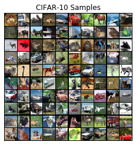
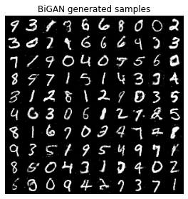

# Various GAN architectures in PyTorch
PyTorch implementations of GAN architectures such as CycleGAN, WGAN-GP and BiGAN as well as simple MLP GAN and non-saturating GAN.

## Models

**Simple GAN for 1D dataset:**

We'll train our generator and discriminator via the original minimax GAN objective:

Using an MLP for both your generator and discriminator, and trained until the generated distribution resembles the target distribution.

**Simple GAN with non-saturating GAN objective for 1D dataset:**

Here, we'll use the non-saturating formulation of the GAN objective. Now, we have two separate losses:

**WGAN-GP for CIFAR-10:**

Using the CIFAR-10 architecture from the [SN-GAN paper](https://arxiv.org/pdf/1802.05957.pdf), with , with . Instead of upsampling via transposed convolutions and downsampling via pooling or striding, we'll use the DepthToSpace and SpaceToDepth methods, described in the repo, for changing the spatial configuration of our hidden states.

We'll implement [WGAN-GP](https://arxiv.org/abs/1704.00028), which uses a gradient penalty to regularize the discriminator. Using the Adam optimizer with , , , , . A batch size of 256 and n_filters=128 within the ResBlocks were used. Trained for approximately 25000 gradient steps, with the learning rate linearly annealed to 0 over training.

**BiGAN on MNIST for representation learning:**

In BiGAN, in addition to training a generator  and a discriminator , we train an encoder  that maps from real images  to latent codes . The discriminator now must learn to jointly identify fake , fake , and paired  that don't belong together. In the original [BiGAN paper](https://arxiv.org/pdf/1605.09782.pdf), they prove that the optimal  learns to invert the generative mapping . Our overall minimax term is now

*Architecture:*

We will closely follow the MNIST architecture outlined in the original BiGAN paper, Appendix C.1, with one modification: instead of having , we use  with . 

*Hyperparameters:*

We make several modifications to what is listed in the BiGAN paper. We apply  weight decay to all weights and decay the step size  linearly to 0 over the course of training. Weights are initialized via the default PyTorch manner.

*Testing the representation:*

We want to see how good a linear classifier  we can learn such that 

where  is the appropriate label. Fix  and learn a weight matrix  such that your linear classifier is composed of passing  through , then multiplying by , then applying a softmax nonlinearity. This is trained via gradient descent with the cross-entropy loss.

As a baseline, randomly initialize another network  with the same architecture, fix its weights, and train a linear classifier on top, as done in the previous part.

**CycleGAN:**

In [CycleGAN](https://arxiv.org/pdf/1703.10593.pdf), the goal is to learn functions  and  that can transform images from  and vice-versa. This is an unconstrained problem, so we additionally enforce the *cycle-consistency* property, where we want 

and  

This loss function encourages  and  to approximately invert each other. In addition to this cycle-consistency loss, we also have a standard GAN loss such that  and  look like real images from the other domain. 

## Datasets

| Name | Dataset |
|------|---------|
| 1D Dataset     |         |
| CIFAR-10     |         |
| MNIST     |         |
| Colorized MNIST     |         |

## Samples and results

| Model | Dataset | First epoch |  Last epoch |
|------|---------|---------|---------|
| Simple GAN         | 1D Dataset  |  | |
| Non-saturating GAN | 1D Dataset  |  | |

| Model | Dataset | Generated samples |
|------|---------|---------|
| WGAN-GP  | CIFAR-10 |  |

> WGAN-GP gets an inception score of 7.28 out of 10. The real images from CIFAR-10 get 9.97 of 10.

| Model | Dataset | Generated samples | Reconstructions |
|------|---------|---------|---------|
| BiGAN  | MNIST |  |  |

| Model | Dataset | Generated samples | Reconstructions |
|------|---------|---------|---------|
| CycleGAN  | MNIST and Colorized MNIST |  |  |

**Inception scores:**

| Model | Dataset | Inception score | Inception score on real images |
|------|---------|:---------:|:---------:|
| WGAN-GP  | CIFAR-10 | 7.28/10 | 9.97/10 |
| WGAN-GP  | CIFAR-10 | 7.28/10 | 9.97/10 |

> *For CycleGAN:* To the left is a set of images showing real MNIST digits, transformations of those images into Colored MNIST digits, and reconstructions back into the greyscale domain. To the right, a set of images showing real Colored MNIST digits, transformations of those images, and reconstructions.

